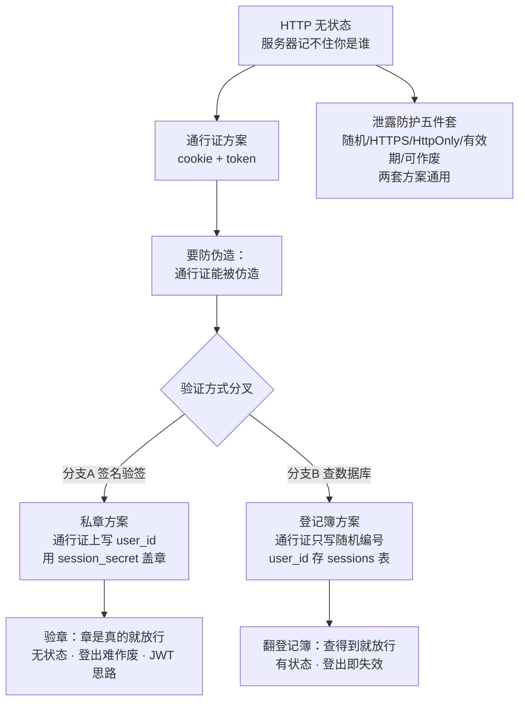

# 🗺️ M1 开发路径图（认证）

> 本文件是 **M1 阶段专属**指南：从哪个文件开始写、按什么顺序、每个文件该写什么。
> 配合 `structure.md`（设计稿）和每个 `.rs` 文件里的【教学注释】一起看。
>
> 协作模式：老师（Copilot）写定义与教学注释，学生（用户）写实现。
> 实现完成后做【理解验证（填空题）】，全部答对才算 M1 完成。

---

## 阶段文档索引

| 阶段 | 文档 | 状态 |
|------|------|------|
| M0 脚手架 | [`M0.md`](M0.md) | ✅ 已完成 |
| M1 认证 | [`M1.md`](M1.md) | 📝 定义完成，待实现 |
| M2 基础数据 | `M2.md` | ⬜ 未开始（到时创建） |
| M3 计划 | `M3.md` | ⬜ 未开始 |
| M4 训练记录 | `M4.md` | ⬜ 未开始 |
| M5 历史回顾 | `M5.md` | ⬜ 未开始 |
| M6 备份与体验 | `M6.md` | ⬜ 未开始 |
| M7 打磨 | `M7.md` | ⬜ 未开始 |

---

## 一、M1 要做什么（一句话）

**让系统知道"你是谁"**：注册（管理员邀请制）→ 登录（发"通行证"cookie）→ 访问时验证通行证（路由守卫）→ 登出（销毁通行证）。

M0 时任何人都能访问首页；M1 之后，**没登录的只能看登录页**。

---

## 二、核心概念：Cookie + Session（先理解再动手）

这是 M1 的灵魂，必须先懂。之前学的 `session_secret`（"私章"）属于**另一套方案**，
动手前先看下面的【知识分区地图】，避免概念混乱。

### 📐 知识分区地图：两套方案，一条分界线



**三层分区**：

| 层 | 内容 | 属于 |
|----|------|------|
| 第一层 · 地基 | HTTP 无状态 → 为什么需要通行证；泄露防护五件套 | 两套方案共享 |
| 第二层 · 分叉点 | 服务器怎么验证通行证：看章（签名）还是翻簿（查库） | 只选其一 |
| 第三层 · 方案内部 | A：无状态/登出要黑名单；B：有状态/登出即失效 | 各自的地盘，勿互相套用 |

**本项目 M1 用哪套？→ 分支 B（查数据库方案）**：
- 通行证 = 随机编号（uuid），**不写 user_id**，身份对应关系存在 `sessions` 表
- 服务器验证 = **翻登记簿**（拿 token 去 SELECT），不是验章
- `session_secret`（私章）目前是**预留字段**（装饰品），M4+ 升级签名方案时才真正用

### 本项目实际的登录流程图（查数据库方案）

```
登录成功
   │
   ▼
服务器生成随机 token（uuid），把 (token, user_id, 过期时间) 存进 sessions 表
   │
   ▼
服务器把 token 放进 cookie 发给浏览器（浏览器保存）
   │
   ▼
之后每次请求，浏览器自动带上 cookie
   │
   ▼
服务器拿 token 去 sessions 表查（SELECT）
   ├── 查得到 → 通行证有效 → 放行（并知道是哪个用户）
   └── 查不到/已过期 → 伪造/失效 → 拒绝（重定向到 /login）
```

**关键点**：
- cookie 存在**浏览器**里（通行证复印件），session 记录存在**服务器数据库**里（登记簿底账）
- token 是随机编号，**不包含用户信息**；身份对应关系在 `sessions` 表
- 销毁 session = DELETE 数据库那一行 → 客户端手里的 cookie 立即变废纸
- `session_secret`（私章）属于分支 A，M1 不用，等 M4+ 开箱

---

## 三、写作顺序（按依赖关系）

```
第1步  src/auth.rs（新文件）  核心：session 的创建/验证/销毁 + 密码哈希
   ↓
第2步  src/handlers/auth.rs（新文件）  登录/登出/注册的 HTTP 处理函数
   ↓
第3步  src/main.rs  注册路由（/login /logout /admin/users...）+ 路由守卫
   ↓
第4步  migrations/0002_sessions.sql（新文件）  session 表
   ↓
第5步  启动时创建管理员（config.rs 加字段 + main.rs 调用）
   ↓
第6步  登录页/注册页（templates/ 或内联 HTML）
   ↓
第7步  M1 理解验证（填空题）
```

> **为什么 auth.rs 最先写？** 因为它不依赖其他新文件，只依赖已有的 `AppConfig`（session_secret）和 `AppState`（pool）。handlers 调用 auth 的函数，main.rs 注册 handlers 的路由。

> 📌 **参考答案位置**：老师的完整实现已备份在 [`M1_ref/`](M1_ref/) 目录
> （`auth_ref.rs`、`handlers_auth_ref.rs`）。
> **实现完成后再对照，不要提前看**（协作约定，见 AGENTS.md）。

> ⚠️ **重要提示**：当前 `auth.rs` 和 `handlers/auth.rs` 里的函数都是
> `unimplemented!()` 占位（骨架），**M1 实现完成前程序无法正常启动**
> （`ensure_admin` 调用密码哈希会 panic）。
> 这是刻意为之：先实现，再启动验证。按第 1→2→3 步顺序写完即可运行。

---

## 四、每步的详细定义与教学注释

### 第 1 步：`src/auth.rs` —— 认证核心（新文件）

**这个文件管三件事**：
1. **密码哈希**：注册时把明文密码用 argon2 变成不可逆的哈希串；登录时比对哈希
2. **Session 生成/验证**：登录成功后创建一个 session（随机 token），存数据库；验证时查 token 是否存在、是否过期
3. **权限判断**：根据 session 查出 user，判断是不是管理员

**需要定义的函数骨架**（你要实现）：

```rust
/// 创建 session：登录成功后调用，生成随机 token 存数据库
pub async fn create_session(pool: &SqlitePool, user_id: i64) -> Result<String, AppError>

/// 验证 session：凭 token 查出用户；无效返回 Err(AppError::Unauthorized)
pub async fn get_user_by_session(pool: &SqlitePool, token: &str) -> Result<User, AppError>

/// 销毁 session：登出时调用
pub async fn destroy_session(pool: &SqlitePool, token: &str) -> Result<(), AppError>

/// 密码哈希：注册时用（argon2）
pub fn hash_password(plain: &str) -> Result<String, AppError>

/// 校验密码：登录时用（argon2 verify）
pub fn verify_password(plain: &str, hash: &str) -> Result<bool, AppError>
```

**教学注释要点**（老师会写在文件里）：
- argon2 是什么：密码哈希算法，**不可逆**（存的是哈希不是明文）
- `uuid` crate 生成随机 token（我们已经在 Cargo.toml 里加了 `uuid` 的 v4 特性）
- session 有效期：存 `expires_at`，验证时检查当前时间是否超过
- 为什么 token 用随机值而不是自增 id：防猜测（自增 id 可被遍历）

### 第 2 步：`src/handlers/auth.rs` —— 登录/登出/注册的 HTTP 层（新文件）

**注意**：这是新目录 `src/handlers/`，以后 M2+ 的页面处理器都放这里（structure.md §1 就是这么规划的）。

**路由对应的 handler**（你要实现）：

| 路由 | 方法 | 功能 | 成功时 |
|------|------|------|--------|
| `/login` | GET | 显示登录页 | 渲染登录表单 |
| `/login` | POST | 提交用户名密码 | 验证通过 → 设置 cookie → 重定向到 `/` |
| `/logout` | POST | 登出 | 销毁 session → 重定向到 `/login` |
| `/admin/users` | GET | 用户管理（仅管理员） | 渲染用户列表 + 创建用户表单 |
| `/admin/users` | POST | 创建用户（仅管理员） | 创建成功 → 重定向回用户管理页 |

**教学注释要点**：
- axum 提取器 `Form<T>`：从 POST 表单里取值（对应 serde 的 Deserialize）
- 设置 cookie：响应头 `Set-Cookie`（tower-http 的 `set_cookie` 或手写）
- 重定向：`Redirect::to("/")`
- 路由守卫：写一个中间件或提取器，验证 session，失败重定向到 `/login`

### 第 3 步：`src/main.rs` —— 注册路由 + 守卫

**你要改的地方**：
1. 加 `mod auth;` 和 `mod handlers;`
2. Router 里加路由：
```rust
.route("/login", get(handlers::auth::login_page).post(handlers::auth::login))
.route("/logout", post(handlers::auth::logout))
.route("/admin/users", get(handlers::auth::admin_users).post(handlers::auth::admin_create_user))
```
3. 给需要保护的页面加守卫（中间件或提取器）

### 第 4 步：`migrations/0002_sessions.sql` —— session 表

```sql
CREATE TABLE IF NOT EXISTS sessions (
    id         INTEGER PRIMARY KEY AUTOINCREMENT,
    user_id    INTEGER NOT NULL REFERENCES users(id),
    token      TEXT NOT NULL UNIQUE,           -- 随机 token（uuid）
    expires_at TEXT NOT NULL,                  -- 过期时间
    created_at TEXT NOT NULL DEFAULT (datetime('now', 'localtime'))
);
```

### 第 5 步：启动时创建管理员

structure.md §7 部署方案说："首次启动创建管理员账号（启动参数/环境变量指定）"。

**设计**：
- `config.rs` 加字段：`admin_username`、`admin_password`（环境变量 `ADMIN_USERNAME` / `ADMIN_PASSWORD`，默认值空）
- `main.rs` 启动时调用一个 `ensure_admin(&pool, &config)`：如果 users 表为空且配置了管理员信息 → 创建管理员

### 第 6 步：登录页/注册页

M2 才学 askama 模板，所以 M1 先用**内联 HTML 字符串**（简单表单），把登录页做出来即可。

```html
<form method="post" action="/login">
    <input name="username" placeholder="用户名">
    <input name="password" type="password" placeholder="密码">
    <button>登录</button>
</form>
```

---

## 五、M1 验收标准

> 实现完成后逐项勾选（⏳ 待你实现后勾选，全部打勾才算完成）：

- [x] `cargo check` 无错误
- [ ] 启动后访问 `/login` 显示登录页（⏳ 依赖第 3 步 main.rs 注册路由 + 第 6 步登录页）
- [ ] 用配置的管理员账号登录成功，跳转到首页（⏳ 依赖第 3、5 步）
- [ ] 未登录访问 `/` 被重定向到 `/login`（路由守卫生效）（⏳ 依赖第 3 步）
- [ ] 登录后 cookie 里的 session 有效；登出后再次访问被拒绝（⏳ 依赖第 3 步）
- [ ] 非管理员访问 `/admin/users` 被拒绝（⏳ 依赖第 3 步）
- [ ] 管理员能创建新用户（邀请制）（⏳ 依赖第 3 步）
- [x] 理解验证：独立完成 [七、M1 理解验证（填空题）](#七m1-理解验证填空题)，全部答对才算通过

> ✅ 已完成：cargo check 零错误（8ec006e 时验证）；理解验证 5 题批改通过（Q1/Q2/Q4/Q5 正确，Q3 概念澄清）。
> ⏳ 剩余 6 项：全部依赖 M1 第 3~6 步（main.rs 注册路由 → migrations → 启动创建管理员 → 登录页），
> 完成后启动服务器逐项实测再勾选。

---

## 六、常见坑（写代码时注意）

| 坑 | 解决办法 |
|---|---|
| argon2 哈希每次结果不同 | 正常！argon2 带随机盐，验证用 `verify` 而非重新哈希比对 |
| cookie 没生效 | 检查 `Set-Cookie` 头的 `Path=/` 和 `HttpOnly` 属性 |
| 登录后重定向回首页还是显示登录页 | 检查守卫逻辑：是否每次都重新验证 session |
| session 一直有效不失效 | 检查 `expires_at` 比较逻辑（当前时间 > expires_at 才失效） |
| 非管理员能访问管理页 | 路由守卫里只查了"是否登录"，没查 `is_admin` |
| 表单提交 400 错误 | 检查 `Form<T>` 里的字段名是否和 HTML 的 `name` 一致 |
| 大括号换行 | 项目约定：函数体左大括号换行（Allman 风格） |
| 禁止 unsafe（项目规则） | 任何地方都别用 unsafe |

---

## 七、M1 理解验证（填空题）

> 【说明】实现完成后，独立完成下面的填空题。
> **规则：不查资料、不翻代码、不问我**，凭自己的理解写答案。
> 允许用大白话、类比，不要求标准术语。答完再对照参考答案检查。
> 全部答对（或理解正确）才算通过本项。

### 第 1 题：session 和 cookie 的关系
登录成功后，服务器生成一个随机 token 存入数据库的 sessions 表，
然后把 token 放进 cookie 发给浏览器。之后每次请求浏览器自动带上 cookie，
服务器靠______识别出"这是哪个用户"。
（提示：cookie 里存的是 token，服务器拿 token 去查什么？）

### 第 2 题：为什么密码要哈希存储
数据库的 users 表存的是 `password_hash` 而不是明文密码，
原因是______。
（提示：想想数据库泄露时，明文密码会怎样？哈希后呢？）

### 第 3 题：路由守卫为什么能"拦住"未登录请求
访问需要登录的页面时，服务器先检查______，
如果没有（或无效），就重定向到登录页。
（提示：想想守卫检查的是"浏览器带没带什么"。）

### 第 4 题：管理员邀请制怎么实现的
普通用户不能自己注册，只有管理员能创建用户。
实现方式是：______。
（提示：想想注册入口在哪、谁有权限调用它。）

### 第 5 题：为什么 handler 传 State<AppState> 而不是直接传连接池
`login` 函数签名写的是 `State(state): State<AppState>`，
查数据库时用 `&state.pool` 取连接池。为什么不直接写 `pool: SqlitePool`？
原因是：______。
（提示：想想 handler 是谁调用的、AppState 里现在有什么、以后可能加什么。）

### 参考答案（先自己写，再对照）

<details>
<summary>点击展开参考答案</summary>

**第 1 题**：服务器拿 cookie 里的 token 去数据库的 sessions 表查，
找到对应记录，就知道 user_id，从而识别出是哪个用户。
（token = 通行证的编号，数据库 = 通行证的登记簿。）

**第 2 题**：密码哈希是不可逆的。数据库泄露时，攻击者拿到的是哈希串，
无法反推出明文密码（argon2 带随机盐，彩虹表也失效）。
即使同一密码在不同用户那里，哈希也不同。而存明文的话，泄露=全泄露。

**第 3 题**：服务器先检查请求里有没有带 session cookie（token），
再用 token 去验证（查 sessions 表 + 查过期时间）。
没带或无效 → 没有有效 session → 说明没登录 → 重定向到 /login。

**第 4 题**：注册入口只放在管理员的用户管理页（/admin/users），
且该页路由守卫要求 is_admin=true 才放行。
普通用户根本没有创建用户的入口，也无法调用创建用户的接口（被守卫拦截）。

**第 5 题**：handler 的签名由 axum 的提取器系统决定，
每个参数必须是提取器能识别的类型（State/Form/HeaderMap 等），
axum 在请求进来时自动注入，`pool: SqlitePool` 不是提取器，编译不过。
而且 AppState 是"工具箱"（现在是 pool + config，以后还会加字段），
传整个 AppState 以后加依赖不用改所有 handler 的签名。
（对比：auth.rs 里的普通函数是我们自己调的，所以直接收 pool 参数。）

</details>

> 全部答完并对照后，回去把第五节验收标准逐项勾选，M1 才算完成 ✅
