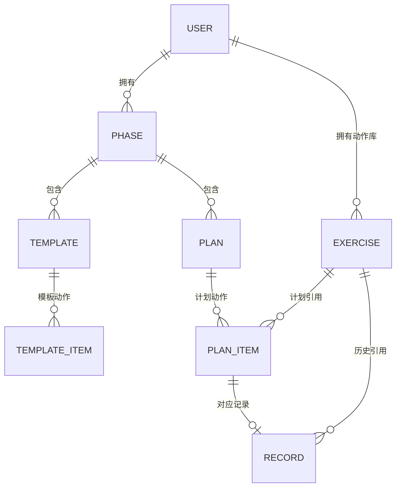
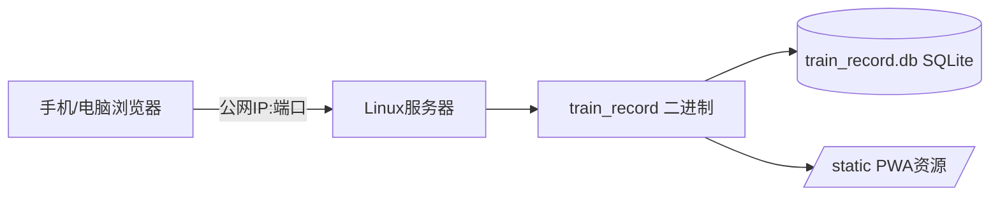

# 训练记录系统 · 需求与技术设计文档（structure.md）

> 本文档由多轮需求调查整理而成，是项目的**设计地基**。后续开发、评审均以此为准；如有变更，先改此文档再改代码。

---

## 1. 项目背景

原系统是 `Python_pkg/` 下的一个 Python 健身训练记录程序，工作流为：

1. 在 OneNote 上规划每天的训练计划
2. 训练时用 OneNote 查看计划并记录
3. 回家后将 OneNote 记录**复制粘贴**到 `Python_pkg/table.xlsx`
4. `pandas` 读取 xlsx 归档至 `Python_pkg/all_data/{阶段}/{动作}.csv`

### 原有缺陷

| 缺陷 | 说明 |
|------|------|
| OneNote 配合不便 | 计划与记录割裂在笔记软件中，无结构 |
| 行数限制数据断层 | pandas/CSV 读写方式导致长期使用后记录丢失 |
| 非即时归档 | 训练完要回家手动复制粘贴到 Excel 再导入 |

### 项目目标

1. **Rust 重写**整个系统
2. **数据库**（SQLite）替代 CSV 存储
3. **部署在 Linux 服务器**，公网 IP + 端口访问
4. **手机/电脑浏览器访问**，训练前制定计划、训练时查看计划与记录、即时落库

---

## 2. 需求调查结论（多轮对话汇总）

以下结论均来自与用户的逐轮确认，是设计的第一依据。

### 2.1 使用场景
- **多用户**：需要账号系统，数据互相隔离
- **注册方式**：**管理员邀请制**——仅管理员能创建账号，避免陌生人注册

### 2.2 核心领域概念：训练阶段（Phase）
> 用户澄清：现有 `all_data/` 下的目录（如 `phase1`、`phase2`）**不是"训练方法"，而是"训练阶段"**。
> 例如"phase1"是某一段训练期；停训后，该段训练归档为一个阶段；再训练时另开新阶段。

**阶段生命周期**：创建 → 训练（记录绑定阶段）→ 停训归档（只读可查看）→ 重新启用或另开新阶段

### 2.3 计划（Plan）与模板（Template）
- 每日计划**人工制定**，不自动循环
- **模板绑定阶段**：每个阶段可有多个模板（如 A/B 分化），建计划时从模板选动作，仍可人工调整
- 当日计划 = 动作列表，每个动作含计划重量/组数/次数

### 2.4 训练记录（Record）粒度
- **动作级**：一个动作一条记录
- 记录字段：实际重量、组数、次数、休息、感受、策略、要领
- 训练时页面**对比计划 vs 实际**填写

### 2.5 当日使用流程（用户重点补充）
> "训练过的动作要支持重新回去查看或编辑。最好把一天的记录当作一个列表，可以点击任意一个进去查看编辑。"

- 登录后默认进入**今日页**
- 今日页 = 当日动作列表（每个动作有"已训练/未训练"状态）
- 点任意动作 → 展开/进入该动作的记录区：查看计划、填实际、保存
- **所有保存即时落库**（无"归档"按钮，每完成一个动作即保存）
- 训练中可随时回去查看/编辑任何已训练动作

### 2.6 历史查看
- **日历视图 + 日期列表都要**
- 日历：每天一个标记（有记录/无记录），点某天 → 看当天全部记录
- 日期列表：按阶段列出所有训练日
- 动作详情页：历史记录表格 + 重量/1RM 随时间折线图

### 2.7 策略（Strategy）字段
- **自由文本 + 自动提醒**
- 当日计划中某动作若上次训练留有策略，**计划页内显示上次策略提示**（训练时对照执行）
- 结构化（下次重量/组数）暂不做

### 2.8 1RM 计算
- **保留**现有公式：Epley（1RM）+ Wathan（MRM），动作详情中显示计算值

### 2.9 重量录入与换算（重要）
原系统 `table.xlsx` 的"强度"列直接存 **eval 表达式**，靠 Python 反射求值：

| 表达式 | 含义 | 公式 |
|--------|------|------|
| `bar(x, olympic)` | 杠铃：单边片重 x，杆重 20 | 总重 = 2x + 杆重 |
| `lb2kg(x)` | 磅转公斤 | x / 2.2046 |
| `lb2kg(x)*2` | 双边片重（合计） | 2 × (x/2.2046) |
| `std(x)` | 原值 | x |
| `support(s)` | 自重动作，支撑量 s | 总重 = 体重 − s |

**新系统设计**（用户确认）：
- 界面提供**换算器**：训练时输入"片重/磅值"并选模式，实时显示换算后的总重量，可微调
- **库存最终总重量**
- **杆重按动作可配置**（olympic=20, short=10, smith=11.3, 双边(0kg) 为常见默认值，但每动作可改；双边(0kg) 用于倒蹲等无杆动作）

### 2.10 要领（Key）字段
- **保留**：动作有标准要领文本，历史记录保存当次要领，训练时展示

### 2.11 动作静态属性（用户确认：都要）
| 属性 | 说明 |
|------|------|
| 名称 | 必需，唯一标识 |
| 部位分组 | 胸/背/腿/肩/臂/核心等，便于建计划时筛选 |
| 默认模式 | 每动作默认杆重/模式（杠铃20kg、自重体重支撑等） |
| 默认组数次数 | 建计划时预填（**支持修改**） |
| 要领 | 动作标准要领文本 |

### 2.12 数据备份
- **导出/导入 + CSV**
- 提供数据库备份文件下载 + 恢复上传
- 保留导出 CSV/JSON 能力

### 2.13 时区
- **中国时区（UTC+8）自然日**作为"当日"边界

---

## 3. 技术栈选型（方案A：Rust 全栈服务端渲染）

经对比，用户选择**方案A**。

| 层面 | 选型 | 说明 |
|------|------|------|
| 语言 | Rust (edition 2024) | 全栈单一语言 |
| Web 框架 | **Axum** | Rust 最主流、生态好、基于 tokio |
| 数据库 | **SQLite**（sqlx 驱动，内嵌无服务） | 数据量小、零运维、单文件备份 |
| SQL 访问 | **sqlx**（编译期检查 SQL） | 类型安全 |
| 模板 | **Askama** | Rust 编译期模板引擎，服务端渲染 HTML |
| 前端交互 | 少量原生 JS | 折叠/弹窗/表单；不引框架 |
| 图表 | **Chart.js**（CDN 引入） | 折线图轻量够用 |
| PWA | manifest.json + service worker | 可添加到主屏幕、离线缓存 |
| 密码 | **argon2** | 密码哈希（Rust: argon2 crate） |
| 会话 | 服务端 Session（cookie） | 简单可靠 |

### 为什么选方案A（服务端渲染）
- 本项目是个人工具，交互简单（列表、表单、折叠、图表）
- 全栈一种语言，无需 Node.js 构建链
- 部署产物为**单个二进制** + SQLite 文件，拷贝到服务器即可运行
- 学习曲线平缓：只需 Rust + 少量 HTML/CSS/JS

### 项目结构
```
train_record/
├── docs/
│   ├── proposal.md
│   └── structure.md          # 本文档
├── Cargo.toml
└── src/
    ├── main.rs               # 入口，启动服务器
    ├── config.rs             # 配置（端口、数据库路径、SecretKey）
    ├── db.rs                 # SQLite 连接池、数据库初始化/迁移
    ├── error.rs              # 统一错误类型
    ├── auth.rs               # 登录/会话/权限中间件
    ├── models.rs             # 领域模型（阶段/模板/计划/动作/记录）
    ├── handlers/
    │   ├── mod.rs
    │   ├── auth.rs           # 登录登出、用户管理
    │   ├── phase.rs          # 阶段 CRUD、归档、启用
    │   ├── exercise.rs       # 动作库 CRUD
    │   ├── plan.rs           # 模板、当日计划
    │   ├── record.rs         # 训练记录、编辑
    │   └── stats.rs          # 历史、日历、图表数据、1RM
    ├── calc.rs               # 1RM/Epley/Wathan、重量换算逻辑
    ├── templates/            # Askama 模板（.html）
    │   ├── base.html
    │   ├── login.html
    │   ├── today.html        # 今日页（列表式）
    │   ├── exercise_edit.html# 单动作记录/编辑
    │   ├── calendar.html     # 日历
    │   ├── history.html      # 历史列表
    │   ├── exercise_stats.html # 动作详情+图表
    │   ├── phase.html        # 阶段管理
    │   └── admin.html        # 用户管理
    └── static/               # 静态资源（PWA、CSS、JS）
```

---

## 4. 领域模型与数据库设计

### 4.1 ER 关系



### 4.2 表结构（SQLite DDL）

```sql
-- 用户表
CREATE TABLE users (
    id            INTEGER PRIMARY KEY AUTOINCREMENT,
    username      TEXT NOT NULL UNIQUE,          -- 登录名
    password_hash TEXT NOT NULL,                 -- argon2 哈希
    display_name  TEXT NOT NULL DEFAULT '',      -- 显示名
    is_admin      INTEGER NOT NULL DEFAULT 0,    -- 是否管理员
    created_at    TEXT NOT NULL DEFAULT (datetime('now', 'localtime'))
);

-- 训练阶段表
CREATE TABLE phases (
    id         INTEGER PRIMARY KEY AUTOINCREMENT,
    user_id    INTEGER NOT NULL REFERENCES users(id),
    name       TEXT NOT NULL,                    -- 如 "phase2"
    note       TEXT NOT NULL DEFAULT '',         -- 备注
    start_date TEXT,                             -- 开始日期
    archived   INTEGER NOT NULL DEFAULT 0,       -- 0=进行中 1=已归档
    created_at TEXT NOT NULL DEFAULT (datetime('now', 'localtime'))
);

-- 动作库表
CREATE TABLE exercises (
    id           INTEGER PRIMARY KEY AUTOINCREMENT,
    user_id      INTEGER NOT NULL REFERENCES users(id),
    name         TEXT NOT NULL,                  -- 动作名（同用户下唯一）
    body_part    TEXT NOT NULL DEFAULT '',       -- 部位分组：胸/背/腿/肩/臂/核心
    default_mode TEXT NOT NULL DEFAULT 'bar',    -- 默认模式: bar/support/std/lb
    bar_weight   REAL NOT NULL DEFAULT 20.0,     -- 默认杆重（bar 模式，前端预填，DEFAULT 仅兜底）
    default_sets INTEGER NOT NULL DEFAULT 3,     -- 默认组数（前端预填，DEFAULT 仅兜底）
    default_reps INTEGER NOT NULL DEFAULT 8,     -- 默认次数（前端预填，DEFAULT 仅兜底）
    key_points   TEXT NOT NULL DEFAULT '',       -- 动作要领
    created_at   TEXT NOT NULL DEFAULT (datetime('now', 'localtime')),
    UNIQUE(user_id, name)
);

-- 训练模板表（绑定阶段）
CREATE TABLE templates (
    id         INTEGER PRIMARY KEY AUTOINCREMENT,
    phase_id   INTEGER NOT NULL REFERENCES phases(id),
    name       TEXT NOT NULL,                    -- 如 "A分化" "B分化"
    sort_order INTEGER NOT NULL DEFAULT 0
    -- ↑ 预留字段（暂恒为 0）：模板间排序是未来待办（M5/M7，见 docs/todo.md §1.1）
    --   M3 列表查询无 ORDER BY sort_order，不受影响。
    --   注意与 template_items.sort_order（实际字段，enumerate 生成）区分。
);

-- 模板动作项
CREATE TABLE template_items (
    id          INTEGER PRIMARY KEY AUTOINCREMENT,
    template_id INTEGER NOT NULL REFERENCES templates(id),
    exercise_id INTEGER NOT NULL REFERENCES exercises(id),
    sort_order  INTEGER NOT NULL DEFAULT 0,
    plan_sets   INTEGER,                         -- 计划组数（空=用默认）
    plan_reps   INTEGER                          -- 计划次数
);

-- 当日计划表（一次训练日一条）
CREATE TABLE plans (
    id         INTEGER PRIMARY KEY AUTOINCREMENT,
    phase_id   INTEGER NOT NULL REFERENCES phases(id),
    date       TEXT NOT NULL,                    -- 'YYYY-MM-DD' 中国时区自然日
    note       TEXT NOT NULL DEFAULT '',         -- 当日备注
    created_at TEXT NOT NULL DEFAULT (datetime('now', 'localtime')),
    UNIQUE(phase_id, date)
);

-- 计划动作项
CREATE TABLE plan_items (
    id          INTEGER PRIMARY KEY AUTOINCREMENT,
    plan_id     INTEGER NOT NULL REFERENCES plans(id),
    exercise_id INTEGER NOT NULL REFERENCES exercises(id),
    sort_order  INTEGER NOT NULL DEFAULT 0,
    plan_sets   INTEGER,
    plan_reps   INTEGER,
    plan_weight REAL                           -- 计划重量（总重kg，可空）
);

-- 训练记录表（动作级，一条 = 一次动作完成记录）
CREATE TABLE records (
    id          INTEGER PRIMARY KEY AUTOINCREMENT,
    plan_item_id INTEGER REFERENCES plan_items(id),  -- 若从计划录入则关联（可空）
    phase_id    INTEGER NOT NULL REFERENCES phases(id),
    exercise_id INTEGER NOT NULL REFERENCES exercises(id),
    record_date TEXT NOT NULL,                  -- 'YYYY-MM-DD'
    weight      REAL NOT NULL,                  -- 实际总重量 kg
    sets        INTEGER NOT NULL,
    reps        INTEGER NOT NULL,
    rest        INTEGER NOT NULL DEFAULT 0,     -- 组间休息秒
    feeling     TEXT NOT NULL DEFAULT '',       -- 感受（自由文本）
    strategy    TEXT NOT NULL DEFAULT '',       -- 策略/后续安排
    key_points  TEXT NOT NULL DEFAULT '',       -- 当次要领
    mode        TEXT NOT NULL DEFAULT 'bar',    -- 录入时模式
    created_at  TEXT NOT NULL DEFAULT (datetime('now', 'localtime'))
);
CREATE INDEX idx_records_phase ON records(phase_id);
CREATE INDEX idx_records_exercise ON records(exercise_id);
CREATE INDEX idx_records_date ON records(record_date);
```

> 说明：
> - 记录绑定 `phase_id`，切换阶段筛选查看（符合"记录绑定阶段"）
> - `record_date` 存自然日，中国时区由应用层决定"今日"
> - 删除/修改计划不影响历史记录（记录独立存在）
> - 历史 CSV 有 `Mode` 列、xlsx 有 `要领`，均纳入设计

---

## 5. 功能规格

### 5.1 用户与权限
| 功能 | 说明 |
|------|------|
| 注册 | **仅管理员可创建用户**（邀请制）。首个部署时由配置/启动脚本创建管理员 |
| 登录/登出 | 用户名+密码，argon2 哈希，服务端 Session（cookie） |
| 权限 | 管理员：用户管理 + 全部功能；普通用户：仅本人数据 |
| 数据隔离 | 所有查询强制带 `user_id`，杜绝越权 |

### 5.1.x 路由守卫方案演进（M1 → M2+）

**背景**：需要登录才能访问的页面，要在 handler 处理前验证会话。

- **M1（当前方案 B）**：handler 函数体内调用 `require_user(state, headers)`，未登录返回 `Redirect::to("/login")`。
  复用 M1 第 2 步已实现的 `require_user`，改动最小；不引入新 trait。
- **M2+（改造方案 A）**：自定义提取器 `AuthUser`（`impl FromRequestParts<AppState>`）。
  - handler 签名改为 `async fn home(AuthUser(user): AuthUser, State(state): State<AppState>) -> ...`
  - 提取器内部完成：token 提取 → session 验证 → 返回 `User`；失败自动返回 401
  - 好处：每个需要登录的页面只需写 `AuthUser(user)` 一个参数，守卫逻辑零重复；
    还能做组合提取器 `AdminUser`（先验登录、再验 `is_admin`）
  - 触发时机：M2 起页面大量出现（阶段/动作/计划/记录都要登录），
    函数内重复写守卫开始变多，一次性改造为提取器
- **不改的原因**（若未来出现）：无。方案 A 是 axum 正统做法，M2 必须落地。

### 5.2 阶段管理
- 创建阶段：名称、开始日期、备注
- **坚持天数**：阶段有 `start_date` 起始日期，进入/查看阶段时计算并显示"已坚持 N 天"（沿用原 `sys.py` 的 `Duration` 概念，`N = 今天 − start_date`）
- 归档：`archived=1`，归档后阶段**只读**（不可新增计划/记录，可查看）
- 重新启用：`archived=0`
- 阶段列表：进行中 / 已归档 分区展示
- 进入阶段后，系统上下文为"当前阶段"（可切换）

### 5.3 动作库
- 动作 CRUD：名称（唯一）、部位分组、默认模式/杆重、默认组数次数、要领
- 动作列表按部位分组筛选
- 建计划时从动作库选择，自动带默认值（可改）

### 5.4 模板
- 模板绑定阶段，每阶段可多模板（如 A/B 分化）
- 模板 = 有序动作列表（含计划组数/次数）
- 从模板生成当日计划 → 生成后可人工增删改动作、改计划值

### 5.5 当日计划与记录（核心流程）
**今日页（列表式）**：
- 顶部：日期、当前阶段、**坚持天数提示**（当前阶段 `今天 − start_date`，如"本阶段已坚持 128 天"）、备注
- 动作列表：每项显示动作名、计划重量/组数/次数、**状态徽标**（未训练/已训练）、**上次策略提示**（若上次训练有策略）
- 点动作 → 进入该动作记录区（计划页内展开或独立区块）：
  - 上半：计划值（可改）+ 上次记录参考（上次实际重量/组数/次数/感受/策略）
  - 下半：录入实际重量（**换算器**）、组数、次数、休息、感受、策略、要领（预填动作要领）
  - 保存 → 即时落库 → 该动作标记"已训练"
- 已训练动作可随时**重新打开查看/编辑**（改后更新记录）

**重量换算器**（界面内嵌）：
- 模式选择：杠铃 `bar` / 器械 `std` / 自重 `support` / 磅制 `lb2kg`
- 输入片重 → 实时显示总重量
- 杆重按动作默认值带入，可改
- 计算结果可直接填入实际重量

### 5.6 历史查看
- **日历视图**：月历，有记录的日子标记，点日期 → 当天记录列表
- **日期列表**：按阶段列出所有训练日
- **当天详情**：该日全部动作记录（只读/可编辑）
- **动作详情页**：某动作全部历史表格 + 重量/1RM 折线图（Chart.js）

### 5.7 1RM 计算
- Epley：`1RM = W × (1 + reps/30)`
- Wathan：`MRM = 1RM / (1.67 − 0.067 × target_reps)`
- 展示 1RM / 2RM / 3RM（与旧 sys.py 一致）

### 5.8 数据备份
- 管理页提供：导出数据库文件（下载 `.db`）、导入恢复（上传替换）
- 导出 CSV / JSON（按阶段/动作导出）

### 5.9 PWA
- `manifest.json`：名称、图标、主题色
- Service Worker：静态资源缓存，离线可打开已缓存页面
- 手机添加到主屏幕，全屏显示

---

## 6. 页面清单

| 路由 | 页面 | 说明 |
|------|------|------|
| `/login` | 登录页 | |
| `/` | 今日页 | 当日计划+记录（列表式核心页） |
| `/today` | 今日页 | （或直接 `/`） |
| `/phases` | 阶段管理 | 创建/归档/启用/切换 |
| `/exercises` | 动作库 | CRUD、部位筛选 |
| `/templates` | 模板管理 | 按阶段管理模板 |
| `/history` | 历史 | 日历视图 + 日期列表 |
| `/history/{date}` | 当日详情 | 某天全部记录 |
| `/exercises/{id}` | 动作详情 | 表格 + 折线图 + 1RM |
| `/admin/users` | 用户管理 | 管理员专属 |
| `/admin/backup` | 备份 | 导出/导入 |

**移动端优先设计**：单列布局、大按钮、响应式断点（手机/平板/桌面）。

---

## 7. 部署方案



### 部署步骤（已实测，Ubuntu 24.04）
1. `cargo clean && cargo build --release` → 产出**单二进制**（约 8M，迁移已编译嵌入，自带建表）
2. 拷贝二进制 + `static/` 目录到服务器 `/opt/train_record/`（注意：static 是相对路径，必须与程序同目录）
3. 配置环境变量：`PORT`（如 80）、`DATABASE_PATH`（如 `/var/lib/train_record/train_record.db`）、`SESSION_SECRET`
4. 首次启动用 `ADMIN_USERNAME` / `ADMIN_PASSWORD` 自动创建管理员
5. 后台运行：`nohup ./train_record > app.log 2>&1 &`（完整命令见 README「部署」章节）
6. 公网 IP + 端口直接访问（如 `http://1.2.3.4:80`）
7. 部署版（80）与开发版（8080）可同时运行：端口不同 + 数据库路径不同 → 数据天然隔离

### systemd 托管（可选，长期运行推荐）
```ini
# /etc/systemd/system/train_record.service
[Unit]
Description=Train Record Server
After=network.target

[Service]
WorkingDirectory=/opt/train_record
Environment=PORT=80
Environment=DATABASE_PATH=/var/lib/train_record/train_record.db
Environment=ADMIN_USERNAME=admin
Environment=ADMIN_PASSWORD=admin123
ExecStart=/opt/train_record/train_record
Restart=always

[Install]
WantedBy=multi-user.target
```
```bash
sudo systemctl enable --now train_record   # 开机自启 + 启动
sudo systemctl status train_record         # 查看状态
sudo journalctl -u train_record -f         # 查看日志
```

> 安全提示：公网直连时建议设置强密码；如长期使用可后续加 Nginx 反代 + HTTPS（本期不包含）。
> 完整部署实操（target 清理、文件位置、后台命令）见 `README.md`「部署（生产环境）」章节。

---

## 8. 开发计划（里程碑）

| 阶段 | 内容 | 产出 |
|------|------|------|
| M0 脚手架 | Cargo 项目、依赖、目录结构、SQLite 初始化 | 空服务可启动 |
| M1 认证 | 用户表、管理员初始化、登录/登出、Session 中间件 | 可登录 |
| M2 基础数据 | 阶段 CRUD、动作库 CRUD | 数据建模落地 |
| M3 计划 | 模板 CRUD、从模板建当日计划、计划动作增删改 | 可制定计划 |
| M4 训练记录 | 今日页列表、单动作记录/编辑、换算器、上次策略提示、即时落库 | **核心流程跑通** |
| M5 历史 | 日历、日期列表、当日详情、动作详情+折线图+1RM | 可回溯 |
| M6 备份与PWA | 导出/导入、CSV/JSON 导出、manifest+SW | 可用性完善 |
| M7 打磨 | 响应式、移动端体验、空态、错误处理、部署文档 | 可部署 |
| M8 REST API | `/api/v1/...` JSON 接口（认证/阶段/动作/计划/记录/统计），为 iced GUI 客户端铺路 | 前后端分离可对接 |

> 每阶段完成即编译运行验证；M4 是最关键里程碑。
> M8 起系统进入"前后端分离"：web 版继续用服务端渲染（手机训练场景），
> API 层给未来的 iced 桌面客户端（电脑管理场景）使用，二者共用同一数据库。

---

## 9. 技术栈学习路径（针对"非科班、只有 C++/Rust 基础"）

### 必须掌握（按顺序）

| # | 主题 | 学到什么程度 | 建议资源 |
|---|------|------------|---------|
| 1 | **Rust 异步与 tokio** | 理解 `async/await`、`tokio::main`、基本并发模型即可，不用深入 | Rust 官方 async book 前几章 |
| 2 | **Axum 基础** | 路由定义、handler 签名、提取器（Path/Query/Form/State）、中间件、错误处理 | axum 官方 examples |
| 3 | **sqlx 基础** | `SqlitePool`、`query!`/`query_as!`、事务（简单 CRUD 够用） | sqlx 官方 book 的 SQLite 部分 |
| 4 | **Askama 模板** | 模板语法（变量、if/for、include 继承 base）、表单提交 | askama 文档 |
| 5 | **HTTP 基础** | GET/POST、表单编码、cookie、session 概念（只用到概念层） | 任一 HTTP 入门 |
| 6 | **SQL 基础** | CREATE/INSERT/SELECT/UPDATE/DELETE、JOIN、索引（本项目用到的子集） | SQLite 官方教程 |
| 7 | **HTML/CSS/JS 最小集** | 表单、`<div>` 布局、Flexbox、事件监听、fetch（仅少量） | MDN 入门 |

### 了解即可（不深究）
- 线程/进程模型（知道 tokio 是异步运行时即可）
- 密码学原理（知道 argon2 是密码哈希，不实现算法）
- PWA 原理（照 manifest/SW 模板配置）
- 部署（systemd 服务文件照抄模板）

### 不需要学
- TypeScript/前端框架（方案A 无 Node 构建链）
- 微服务、消息队列、Redis 等（本项目用不到）
- 分布式、高并发（个人工具数据量小）

### 学习建议
- **不要先看书再动手**：跟着 M0→M7 里程碑边做边学
- 每个里程碑是自包含的学习单元，查文档/例子解决当下问题
- Axum 和 sqlx 的官方 examples 是最好的参考资料

---

## 10. 待确认/后续可迭代项（本期不做）

- 迁移工具（历史 CSV/xlsx → 数据库）：**另设计独立工具**，系统本身不含
- HTTPS/域名：本期公网 IP + 端口直连，后续可加 Nginx 反代
- 策略结构化（下次重量/组数自动生成）：暂自由文本
- 组级记录（每组分别记录）：本期动作级
- 多语言/主题切换：非必要
